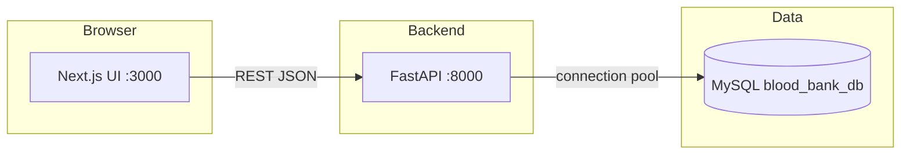

# Blood Bank Management System

A full-stack academic project for recording blood bank operations: donors, recipients, staff, donations, transfusions, blood tests, inventory, and summary reports.

The active application is a **Next.js** frontend talking to a **FastAPI** backend that stores data in **MySQL**.

[](https://www.python.org/)
[](https://fastapi.tiangolo.com/)
[](https://nextjs.org/)
[](https://react.dev/)
[](https://www.mysql.com/)
[](https://www.typescriptlang.org/)

---

## Description

Staff-facing forms and tables let you register people, log clinical events, and view stock. The API validates input (age 18–65, 10-digit contact numbers), uses a MySQL connection pool, and exposes interactive docs at `/docs`.

There is **no login or authentication** in the current codebase. The UI is open once the servers are running.

---

## Features

Implemented in `blood/main.py` and `blood-bank-frontend/`:

| Feature | What it does |
| --- | --- |
| Donor registration | Create donors (name, age, gender, blood group, contact) |
| Recipient registration | Create recipients with the same fields |
| Blood inventory | List units by blood group; auto-refresh on the inventory page |
| Staff records | Add staff (Doctor, Nurse, Lab Technician, Receptionist, Administrator) |
| Donations | Record a donation by donor ID and date; increments that donor’s blood group in inventory |
| Transfusions | Record a transfusion by recipient ID and date (does not change inventory) |
| Blood tests | Record a donor test result (Positive, Negative, Inconclusive) |
| Reports | Tabbed tables of donors, recipients, and inventory, with refresh |
| Validation | Zod on the client; Pydantic on the server |
| CORS | Configurable allowed origins for the Next.js app |
| Responsive nav | Desktop links and a mobile sheet menu |
| Light / system theme | `next-themes` in the root layout |

Not implemented: user accounts, JWT/session auth, edit/delete of records, inventory decrease on transfusion, real file export (Export currently shows an alert).

---

## Technology stack

| Layer | Technologies |
| --- | --- |
| Frontend | Next.js 15 (App Router), React 19, TypeScript, Tailwind CSS, Radix UI, React Hook Form, Zod |
| Backend | FastAPI, Uvicorn, Pydantic, `mysql-connector-python`, python-dotenv |
| Database | MySQL (`blood_bank_db`) |
| Container (API only) | Docker (`blood/Dockerfile`, Python 3.12) |

`blood/app.py` and `blood/templates/` are an older Flask prototype (different table/column names). **Run `blood/main.py` for the API the Next.js app uses.**

---

## Architecture



```
BLOOD BANK MANAGEMENT/
├── blood/                      # FastAPI API
│   ├── main.py                 # Routes, models, DB access
│   ├── blood_bank_db.sql       # Schema used by the API
│   ├── requirements.txt
│   ├── Dockerfile
│   ├── .env.example
│   ├── app.py                  # Legacy Flask (not used by the Next.js UI)
│   └── templates/              # Legacy Jinja HTML
├── blood-bank-frontend/        # Next.js UI
│   ├── app/                    # Pages (donor, recipient, …)
│   ├── components/
│   ├── lib/api.ts              # Backend base URL helper
│   ├── package.json
│   └── .env.example
├── templates/                  # Empty placeholder at repo root
└── README.md
```

---

## How it works

1. Create the MySQL database from `blood/blood_bank_db.sql`.
2. Start FastAPI. It loads `blood/.env`, opens a pool of 5 connections, and serves REST endpoints.
3. Start Next.js. Browser requests go to `NEXT_PUBLIC_BACKEND_URL` (default `http://127.0.0.1:8000`).
4. Creating a donation looks up the donor, inserts a `Donations` row, then `quantity + 1` (or inserts the blood group if missing).
5. Reports `GET /reports/` returns donors, recipients, and inventory together for the Reports page.

---

## Database

Schema: `blood/blood_bank_db.sql` (a copy also exists under `blood-bank-frontend/`). Database name: **`blood_bank_db`**.

| Table | Columns | Notes |
| --- | --- | --- |
| `Donors` | `donor_id`, `name`, `age`, `gender`, `blood_group`, `contact_number` | PK auto-increment |
| `Recipients` | `recipient_id`, `name`, `age`, `gender`, `blood_group`, `contact_number` | |
| `Blood_Inventory` | `blood_id`, `blood_group`, `quantity` | Updated on donation |
| `Staff` | `staff_id`, `name`, `role`, `contact_number` | |
| `Donations` | `donation_id`, `donor_id`, `donation_date` | FK → `Donors` |
| `Transfusions` | `transfusion_id`, `recipient_id`, `transfusion_date` | FK → `Recipients` |
| `Blood_Tests` | `test_id`, `donor_id`, `test_date`, `result` | FK → `Donors` |

---

## Prerequisites

- Python **3.12+**
- Node.js **18+** (npm)
- MySQL **8+**
- Optional: Docker (API image only)

---

## Installation and setup

### 1. Clone

```bash
git clone <your-repo-url>
cd "BLOOD BANK MANAGEMENT"
```

### 2. Database

```bash
mysql -u root -p < blood/blood_bank_db.sql
```

### 3. Backend environment

```bash
cd blood
cp .env.example .env
```

Edit `.env` locally. Do not commit it. Names (from `.env.example`):

| Variable | Role |
| --- | --- |
| `MYSQL_HOST` | MySQL host |
| `MYSQL_PORT` | MySQL port |
| `MYSQL_USER` | MySQL user |
| `MYSQL_PASSWORD` | MySQL password |
| `MYSQL_DATABASE` | Must match the schema (`blood_bank_db`) |
| `PORT` | API port (default `8000`) |
| `CORS_ORIGINS` | Comma-separated frontend origins |

### 4. Frontend environment

```bash
cd blood-bank-frontend
cp .env.example .env.local
```

| Variable | Role |
| --- | --- |
| `NEXT_PUBLIC_BACKEND_URL` | FastAPI base URL (no trailing slash) |

---

## Run the backend

```bash
cd blood
python3 -m venv .venv
source .venv/bin/activate   # Windows: .venv\Scripts\activate
pip install -r requirements.txt
uvicorn main:app --reload --host 127.0.0.1 --port 8000
```

Or: `python main.py` (binds `0.0.0.0` and uses `PORT`).

| URL | Purpose |
| --- | --- |
| http://127.0.0.1:8000 | Health-style welcome JSON |
| http://127.0.0.1:8000/docs | Swagger UI |
| http://127.0.0.1:8000/redoc | ReDoc |

Docker:

```bash
cd blood
docker build -t blood-bank-api .
docker run --env-file .env -p 8000:8000 blood-bank-api
```

The container still needs a reachable MySQL host (`MYSQL_HOST` is often not `localhost` from inside Docker).

---

## Run the frontend

```bash
cd blood-bank-frontend
npm install
npm run dev
```

Open http://localhost:3000

| Script | Command |
| --- | --- |
| Dev server | `npm run dev` |
| Production build | `npm run build` |
| Start production | `npm run start` |
| Lint | `npm run lint` |

---

## API

Interactive docs: `/docs`. JSON over HTTP. No API keys.

| Method | Path | Description |
| --- | --- | --- |
| `GET` | `/` | Welcome message |
| `POST` | `/donors/` | Create donor (`201`) |
| `GET` | `/donors/` | List donors |
| `POST` | `/recipients/` | Create recipient (`201`) |
| `GET` | `/recipients/` | List recipients |
| `GET` | `/blood_inventory/` | List inventory |
| `POST` | `/staff/` | Create staff (`201`) |
| `POST` | `/donations/` | Record donation; update inventory (`201`, `404` if donor missing) |
| `POST` | `/transfusions/` | Record transfusion (`201`, `404` if recipient missing) |
| `POST` | `/blood_tests/` | Record test (`201`, `404` if donor missing) |
| `GET` | `/reports/` | Donors + recipients + inventory |

Typical donor/recipient body:

```json
{
  "name": "Example Name",
  "age": 30,
  "gender": "Male",
  "blood_group": "O+",
  "contact_number": "9876543210"
}
```

`503` if MySQL is down or credentials in `.env` are wrong.

---

## Screenshots

Replace these with captures from a local run (`docs/screenshots/` is a convenient place).

| Screen | Placeholder |
| --- | --- |
| Home | `` |
| Donor form | `` |
| Inventory | `` |
| Reports | `` |
| API docs | `` |

---

## Future enhancements

Grounded in current gaps:

- Authentication and role-based access (none today)
- Decrement inventory (and check stock) when recording a transfusion
- List/edit/delete for staff, donations, transfusions, and tests
- Real CSV/PDF export instead of the Export alert
- Align or remove the unused Flask prototype
- Seed default blood groups in `Blood_Inventory`

---

## Contributors

| Name | Role |
| --- | --- |
| V T S Mukundan | Author (git history) |

---

## License

No `LICENSE` file is in this repository. All rights reserved unless the owner adds a license.
